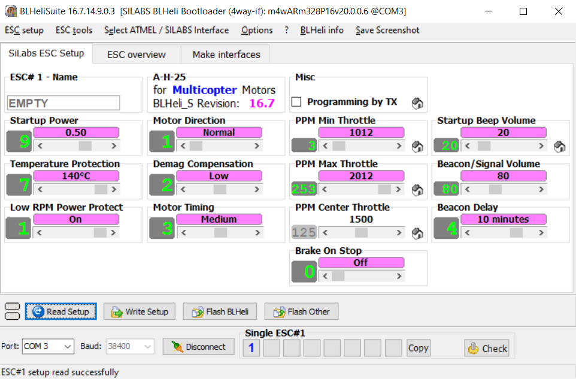

# ESP-IDF component for tiny BLDC motor driver
Currently compatible with BLHeli_S ESC drivers with PWM interface.

## Notes
* In one timer group there can be max 3 BLDC motors.

## BLHeliSuite configuration


## Sources
* https://docs.espressif.com/projects/esp-idf/en/v5.2/esp32/api-reference/peripherals/mcpwm.html
* https://docs.espressif.com/projects/esp-idf/en/v5.2/esp32c3/api-reference/peripherals/ledc.html
* https://github.com/bitdump/BLHeli/tree/master
* https://pl.aliexpress.com/item/4000196497081.html

## Example
``` C
#include <stdio.h>
#include "freertos/FreeRTOS.h"
#include "freertos/task.h"
#include "esp_log.h"
#include "tiny_bldc.h"

#define SIGNAL_PIN_0     GPIO_NUM_1
#define SIGNAL_PIN_1     GPIO_NUM_2
#define SIGNAL_PIN_2     GPIO_NUM_3
#define SIGNAL_PIN_3     GPIO_NUM_4
#define BLDC_LED_PIN     -1

#define BLDC_NUM         4

static const char* TAG = "main";


void app_main(void)
{
    tiny_bldc_conf_t bldc_conf[BLDC_NUM];
    bldc_conf[0].pwm_pin = SIGNAL_PIN_0;
    bldc_conf[1].pwm_pin = SIGNAL_PIN_1;
    bldc_conf[2].pwm_pin = SIGNAL_PIN_2;
    bldc_conf[3].pwm_pin = SIGNAL_PIN_3;

#ifndef CONFIG_IDF_TARGET_ESP32C3
    bldc_conf[0].group_id = 0;
    bldc_conf[1].group_id = 0;
    bldc_conf[2].group_id = 1;
    bldc_conf[3].group_id = 1;

    for (uint32_t i = 0; i < BLDC_NUM; i++)
    {
        bldc_conf[i].led_pin = BLDC_LED_PIN;
        bldc_conf[i].timer = NULL;
        bldc_conf[i].operator = NULL;
        bldc_conf[i].comparator = NULL;
        bldc_conf[i].generator = NULL;

        tiny_bldc_init(&bldc_conf[i]);
    }
#else
    bldc_conf[0].timer = LEDC_TIMER_0;
    bldc_conf[0].channel = LEDC_CHANNEL_0;
    bldc_conf[1].timer = LEDC_TIMER_1;
    bldc_conf[1].channel = LEDC_CHANNEL_1;
    bldc_conf[2].timer = LEDC_TIMER_2;
    bldc_conf[2].channel = LEDC_CHANNEL_2;
    bldc_conf[3].timer = LEDC_TIMER_3;
    bldc_conf[3].channel = LEDC_CHANNEL_3;

    for (uint32_t i = 0; i < BLDC_NUM; i++)
    {
        bldc_conf[i].led_pin = BLDC_LED_PIN;
        tiny_bldc_init(&bldc_conf[i]);
    }
#endif

    // arming
    tiny_bldc_arm(bldc_conf, BLDC_NUM);

    ESP_LOGI(TAG, "start");

    while (1)
    {
        for (uint32_t i = 0; i < BLDC_NUM; i++)
        {
            tiny_bldc_set_speed(&bldc_conf[i], BLDC_MIN_ROT_SPEED);
        }

        // (...)
    }

    ESP_LOGI(TAG, "stop");

    for (uint32_t i = 0; i < BLDC_NUM; i++)
        tiny_bldc_deinit(&bldc_conf[i]);
}
```
